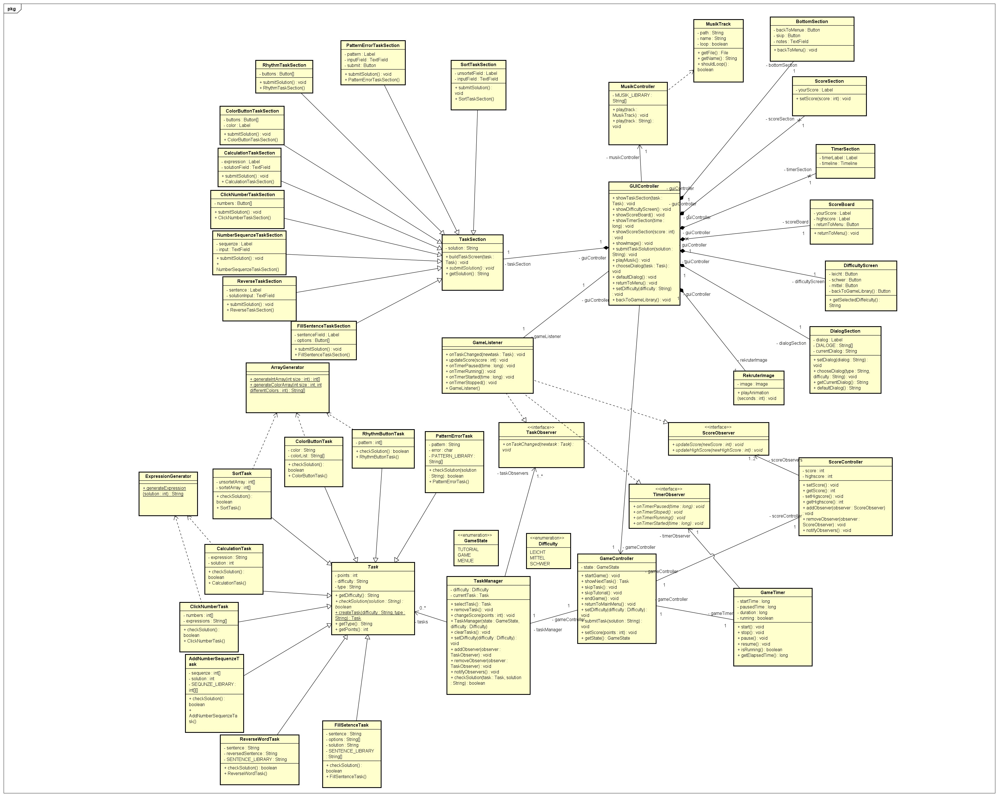
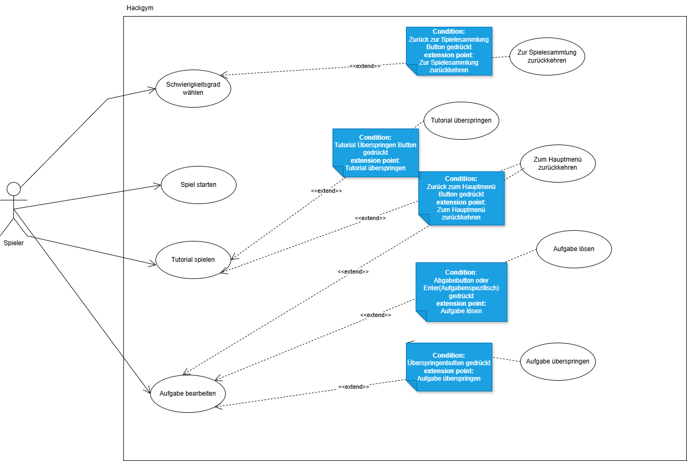

# HackGym - Educational Cognitive Training Game

Ein umfangreiches Java Swing-Lernspiel zur Förderung von mathematischen Fähigkeiten, Mustererkennung und kognitiver Geschwindigkeit im Kontext einer DarkIT-Rekrutierungsstory.


## Projektbeschreibung

HackGym ist ein edukativer Arcade-Trainer, der verschiedene kognitive Fähigkeiten durch 8 abwechslungsreiche Aufgabentypen testet und fördert. Das Spiel wurde im Rahmen eines Gruppenprojekts entwickelt, wobei jedes Teammitglied ein eigenständiges Spiel für die Spielesammlung entwickelte.

**Mein Beitrag:** Vollständige Entwicklung von HackGym inkl. Spiellogik, GUI-Design, MVC-Architektur und UML-Modellierung.

## Features

### Spielmechaniken
- **Timer-basiertes Gameplay** mit Zeitdruck
- **3 Schwierigkeitsgrade** (Leicht, Mittel, Schwer)
- **Dynamisches Punktesystem** mit Bonus und Abzügen
-  **Skip-Funktion** zum Überspringen schwieriger Aufgaben
- **Integriertes Notizfeld** für komplexe Denkaufgaben
-  **Musik**

### Narrative Einbettung
-  **DarkIT-Rekrutierungs-Szenario** mit Story-Kontext
-  **Rekruter-Dialoge** zur Aufgabeneinordnung und Motivation

##  8 Verschiedene Aufgabentypen

| Aufgabe | Beschreibung | Skills |
|---------|--------------|--------|
| **Rechenaufgabe** | Mathematische Ausdrücke lösen | Kopfrechnen, Schnelligkeit |
| **Button-Sequenz** | Zahlen in korrekter Reihenfolge anklicken (auf Mittel: erst Additionen lösen!) | Logik, Sortierung |
| **Farb-Stroop-Test** | Farbwort anklicken, nicht Hintergrundfarbe | Kognitive Kontrolle |
| **Sortieraufgabe** | Zahlenfolge aufsteigend sortieren | Algorithmen |
| **Musterfehler finden** | Abweichung in Zahlen-/Symbolfolge identifizieren | Mustererkennung |
| **Zahlenfolge ergänzen** | Muster erkennen und fortsetzen | Logisches Denken |
| **Satz umkehren** | Rückwärts geschriebenen Text rekonstruieren | Textverarbeitung |
| **Rhythmus-Memory** | Visuelle Sequenz merken und reproduzieren | Kurzzeitgedächtnis |


##  Software-Engineering & Planung

### UML-Klassendiagramm

Die vollständige Systemarchitektur wurde vorab in UML modelliert (Diagramm zeigt Zwischenstand während der Entwicklung):



**Architektur-Highlights aus dem Diagramm:**
- Klare MVC-Separation (GUI-Package vs. Logic-Package)
- 8 spezialisierte Task-Sections mit gemeinsamer Basis-Klasse
- Dedizierte Controller für Game, Music, Score, Timer
- Factory-Pattern für prozedurale Generierung (ArrayGenerator, ExpressionGenerator)
- Task-Management-System mit TaskManager

### Use-Case-Diagramm



**Hauptfunktionen:**
- Schwierigkeitsgrad wählen
- Spiel starten
- Aufgaben lösen/überspringen
- Zwischen Spielesammlung und Hauptmenü navigieren

*Hinweis: Das geplante Tutorial-Feature wurde aus Zeitgründen nicht implementiert, da die Aufgaben durch die Rekruter-Dialoge bereits ausreichend erklärt werden.*

### MVC-Pattern
```
src/
├── Main.java                          # Entry Point
├── de.games.gui.hackgym/             # VIEW Layer
│   ├── GameScreen.java               # Haupt-Spielansicht
│   ├── MusicController.java          # Audio-System
│   ├── sections/                     # UI-Komponenten
│   │   ├── TaskSection.java          # Basis-Klasse für Aufgaben
│   │   ├── CalculationTaskSection.java
│   │   ├── ClickNumberTaskSection.java
│   │   ├── ColorButtonTaskSection.java
│   │   ├── SortTaskSection.java
│   │   ├── PatternErrorTaskSection.java
│   │   ├── AddNumberSequenceTaskSection.java
│   │   ├── ReverseWordTaskSection.java
│   │   ├── RhythmButtonTaskSection.java
│   │   ├── DialogSection.java        # Rekruter-Dialoge
│   │   ├── TimerSection.java
│   │   ├── ScoreBoard.java
│   │   └── DifficultyScreen.java
│   └── ressource/
│       ├── icon/                     # UI-Icons
│       └── sound/                    # Sound-Effekte
└── de.games.logic.hackgym/           # MODEL & CONTROLLER Layer
    ├── GameController.java           # Zentrale Spielsteuerung
    ├── ArrayFactory.java             # Datengenerierung
    ├── ExpressionFactory.java        # Aufgaben-Generator
    ├── enums/                        # Type-safe Enumerationen
    ├── taskManagement/               # Aufgabenverwaltung
    ├── scorelogic/                   # Punkteberechnung
    └── timelogic/                    # Timer-System
```

### Design Patterns
- **MVC (Model-View-Controller):** Klare Trennung von GUI und Logik
- **Factory Pattern:** `ArrayFactory` und `ExpressionFactory` für dynamische Aufgabengenerierung
- **Template Method:** `TaskSection` als Basis-Klasse für alle Aufgabentypen
- **Observer Pattern:** Event-Handling zwischen GUI-Komponenten

### Technologien
- **Java SE** - Programmiersprache
- **Swing** - GUI-Framework
- **Java Sound API** - Audio-Integration
- **Enumerations** - Typsichere Konstanten

## Spielablauf

1. **Hauptmenü** → Schwierigkeitsgrad wählen
2. **Spielbildschirm:**
```
   ┌─────────────────────────────────────┐
   │ Timer: 02:45        Punkte: 1250    │
   ├─────────────────────────────────────┤
   │ Rekruter-Dialog:                    │
   │ "Deine nächste Aufgabe testet..."  │
   ├─────────────────────────────────────┤
   │      [Dynamische Aufgabe]           │
   ├─────────────────────────────────────┤
   │ [Skip] [Notizen...] [Beenden]       │
   └─────────────────────────────────────┘
```
3. **Spielende** → Abschlussbildschirm mit Punktestand
4. **Navigation** → Zurück zur Spielesammlung

##  Technische Highlights

-  **Modulare Architektur:** Jeder Aufgabentyp als eigenständige, erweiterbare Komponente
-  **Dynamische Schwierigkeitsskalierung:** Anpassung von Komplexität und Zeitlimits
- **Event-driven GUI:** Swing ActionListener und Timer für reaktive UI
-  **State Management:** Zentrale Verwaltung von Spielzustand, Timer und Punkten
-  **Factory-based Task Generation:** Prozedural generierte Aufgaben für Wiederspielbarkeit
- **Audio Feedback System:** Immersive Sound-Effekte
- **Resource Caching:** Optimiertes Laden von Icons und Sounds

## Technische Einschränkungen

**Hinweis:** Dieses Projekt entstand im frühen Studienverlauf mit Fokus auf Funktionalität und Architektur-Grundlagen.

- **UI-Design:** Die Benutzeroberfläche nutzt Swing-Standard-Komponenten und ist funktional, aber visuell noch nicht ausgereift.
- **Aufgabengenerierung:** Ein Teil der Aufgaben wird aktuell noch teilweise statisch/manuell definiert, nicht vollständig prozedural generiert. Die Factory-Klassen bilden jedoch die Basis für vollständige Automatisierung.

Diese Punkte wurden bewusst dokumentiert, da sie wertvolle Learnings für Clean Code, Software-Design und User Experience darstellten, die in nachfolgenden Projekten umgesetzt werden.
##  Learnings

- GUI-Design und User Experience mit Java Swing
- MVC-Architektur in der Praxis
- Design Patterns (Factory, Template Method, Observer)
- Event-Handling und State Management
- Spielmechanik-Design und Balancing
- UML-Modellierung für komplexe Anwendungen
- Audio-Integration in Java
- **Iterative Verbesserung:** Erkenntnis, dass UI-Polishing und vollständige Prozeduralisierung wichtige nächste Schritte wären

##  Projektumfang

- **44 Java-Klassen** (~3000+ Zeilen Code)
- **8 verschiedene Aufgabentypen**
- **3 Schwierigkeitsgrade**
- **MVC-Architektur** mit klarer Separation of Concerns
- **Ressourcen-Management** (Icons, Sounds)

---

*Entwickelt im Rahmen eines Gruppenprojekts - Spielesammlung mit 6 verschiedenen Spielen (jedes Teammitglied verantwortlich für ein Spiel)*
